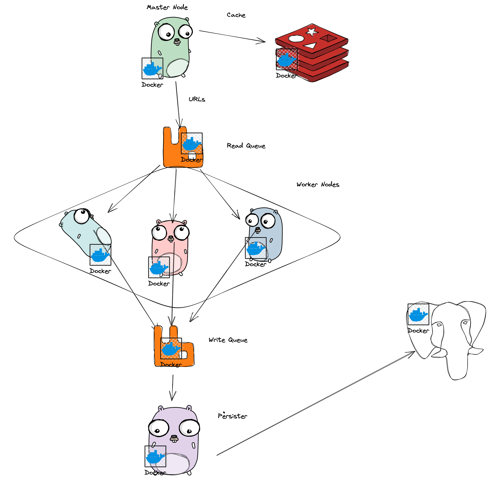

# Architecture


# TODO Things that a distrubuted web crawler needs to think about
## 1. Politeness

One should think about the traffic their crawler will produce.
"Politeness" is being polite to the server owners. There are some conventions we can follow.

`robots.txt` is a file should be in the root of the domain like `baskent.edu.tr/robots.txt` in this file
there should be file like this.


Below file says any User-Agent should disallow below path. We respect this convention in gocraw.
```
User-Agent: *
Disallow: /foo
```

## 2. DNS Query

Since we go BFS all the way down, we'll encounter lots of different domains.
Resoluting these domains can be expensive in terms of time.

There are two aspects of this problem, first is IPS's DNS servers. These servers are generally 
terribly slow, even we never use them in our PCc, smartphones etc moreover I setted default dns to
Google's `8.8.8.8` and `8.8.4.4` in my modem. Also ISP's dns resolvers tend to create buggy behaviour.
For example in this week, 13 December, Superonline did some bad job on their new modem. Our company suffered from this failure. Another big problem especially in crawling is ISP's may randomly assign their static HTMLs to some domains.
This may false feed our crawler, this problem may break some REST API calls too.

Second approach is just settings `8.8.8.8` like proper DNS server. Well this has distance problem, even though we cache in OS our program still needs to go to the far computer of the Google.

We solved this problem by creating local DNS server, only for cache, and fill it with random popular domains.

## 3. Duplicates

Duplicate values are very hard to solve in worker nodes. We solved this problem by centralizing url scheduling with a key value store.
